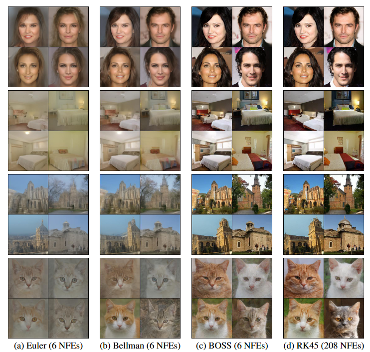

##### Table of contents

1. [Installation](#installation)

2. [Dataset preparation](#dataset-preparation)

3. [How to run](#how-to-run)

4. [Evaluation](#evaluation)

5. [Acknowledgments](#acknowledgments)

6. [Contacts](#contacts)

  

# Bellman Optimal Step-Size Straightening Of Flow-Matching Models

<div  align="center">

<a  href="https://scholar.google.com/citations?user=0X9TWMEAAAAJ&hl=en"  target="_blank">Bao&nbsp;Nguyen</a> &emsp; <b>&middot;</b> &emsp;
<a  href="https://tbng.github.io/"  target="_blank">Binh&nbsp;Nguyen</a> &emsp; <b>&middot;</b> &emsp;
<a  href="https://www.vietanhnguyen.net/"  target="_blank">Viet Anh&nbsp;Nguyen</a>
<br>
<a  href="https://arxiv.org/abs/2312.16414">[Paper]</a> &emsp;&emsp;

<a  href="https://docs.google.com/presentation/d/1ZDZyq14_EOBJATRfd27KY3WEuYxC9P5o/edit?usp=sharing&ouid=117701086559509895224&rtpof=true&sd=true">[Slides]</a> &emsp;&emsp;

</div>

<br>

<div  align="center">



</div>


This paper introduces Bellman Optimal Step-size Straightening (BOSS) technique for distilling flow-matching generative models: it aims specifically for a few-step efficient image sampling while adhering to a computational budget constraint. First, this technique involves a dynamic programming algorithm that optimizes the step sizes of the pretrained network. Then, it refines the velocity network to match the optimal step sizes, aiming to straighten the generation paths.


Details regarding our methodology and the corresponding experimental results are available in [our following paper](https://arxiv.org/abs/2312.16414):


**Please CITE** our paper whenever utilizing this repository to generate published results or incorporating it into other software.

```bash
@article{nguyen2023bellman,
  title={Bellman Optimal Step-size Straightening of Flow-Matching Models},
  author={Nguyen, Bao and Nguyen, Binh and Nguyen, Viet Anh},
  journal={arXiv preprint arXiv:2312.16414},
  year={2023}
}
```

## Installation ##

Python `3.9` and Pytorch `1.11.0+cu113` are used in this implementation.

It is recommended to create `conda` env from our provided config files `./environment.yml` and `./requirements.txt`:
```
conda env create -f environment.yml
conda activate boss
pip install -r requirements.txt
```

If you encounter problems related to CUDNN, try the following command lines:
```
mkdir -p $CONDA_PREFIX/etc/conda/activate.d
echo 'CUDNN_PATH=$(dirname $(python -c "import nvidia.cudnn;print(nvidia.cudnn.__file__)"))' >> $CONDA_PREFIX/etc/conda/activate.d/env_vars.sh
echo 'export LD_LIBRARY_PATH=$CUDNN_PATH/lib:$CONDA_PREFIX/lib/:$LD_LIBRARY_PATH' >> $CONDA_PREFIX/etc/conda/activate.d/env_vars.sh
source $CONDA_PREFIX/etc/conda/activate.d/env_vars.sh
```

## Dataset and pretrained models preparation ##

We use pretrained models on five datasets, including CIFAR10, AFHQ-CAT 256, LSUN Church Outdoor 256, LSUN BEDROOM and CelebA HQ (256). Our method is a data-free method so downloading datasets are unnecessary. The pretrained models are found in [Rectified Flow](https://github.com/gnobitab/RectifiedFlow). Download 5 models from their website and store them in the `./logs` folder as follows:

<ul>
  <li>logs
    <ul>
      <li>1_rectified_flow
        <ul>
          <li>church
            <ul>
              <li>checkpoints
                <ul>
                  <li>checkpoints0.pth</li>
                </ul>
              </li>
            </ul>
          </li>
          <li>cifar10
            <ul>
              <li>checkpoints
                <ul>
                  <li>checkpoints0.pth</li>
                </ul>
              </li>
            </ul>
          </li>
          <li>bedroom
            <ul>
              <li>checkpoints
                <ul>
                  <li>checkpoints0.pth</li>
                </ul>
              </li>
            </ul>
          </li>
          <li>celeba_hq
            <ul>
              <li>checkpoints
                <ul>
                  <li>checkpoints0.pth</li>
                </ul>
              </li>
            </ul>
          </li>
          <li>afhq_cat
            <ul>
              <li>checkpoints
                <ul>
                  <li>checkpoints0.pth</li>
                </ul>
              </li>
            </ul>
          </li>
        </ul>
      </li>
    </ul>
  </li>
</ul>

## How to run ##

**GPU allocation**: Our work is experimented on NVIDIA A5000 GPUs. For finetuning, we use one GPU for CIFAR10, and three GPUs for 256x256 resolution datasets.  

### FID ###

Check out the clean-fid paper [On Aliased Resizing and Surprising Subtleties in GAN Evaluation](https://github.com/GaParmar/clean-fid/tree/main) for generating the stats files and calculating FID score.

For CIFAR10, they will be automatically downloaded in the first time execution.

For CelebA HQ (256) and LSUN, please check out [here](https://github.com/NVlabs/NVAE#set-up-file-paths-and-data) for dataset preparation.

For AFHQ-CAT, please check out [here](https://github.com/clovaai/stargan-v2-tensorflow/tree/master).

We also provide stats files for these datasets at [here](https://drive.google.com/drive/folders/1rNF6jJ5T1UNpLTkuEqwIrFdq9vyw5Cbj). Store these stats files to the folder stats which is in the cleanfid installed folder (`~/anaconda3/envs/boss/lib/python3.9/site-packages/cleanfid/stats`).

### Run pretrained models with Bellmanstepsizes ###

Check out the script(`./ImageGeneration/scripts/evaluate.sh`). Use the method bellman_uniform for DISC_METHODS. 

### Generate data for finetuning ###

Check out the script(`./ImageGeneration/scripts/gen_data.sh`). 

### Finetuning ###

Check out scripts(`./ImageGeneration/scripts/boss.sh and ./ImageGeneration/scripts/reflow.sh`). 

### Evaluate after finetuning ###

Check out scripts(`./ImageGeneration/scripts/evaluate_after_finetuning.sh`).

### Other options ###

This repository is extended to fintune EDM models from [Elucidating the Design
Space of Diffusion-Based Generative Models
(EDM)](https://github.com/NVlabs/edm) and use LORA (Low rank adaptation) for finetuning. Check other folder in scripts for more details.

## Acknowledgments ##

Thanks to Xingchao Liu et al., Yang Song et al., and Tero Karras et al. for releasing their official implementation of the [Flow Straight and Fast: Learning to Generate and Transfer Data with Rectified Flow](https://github.com/gnobitab/RectifiedFlow), [Score-Based Generative Modeling through Stochastic Differential Equations](https://github.com/yang-song/score_sde_pytorch), [Elucidating the Design Space of Diffusion-Based Generative Models (EDM)](https://github.com/NVlabs/edm) papers and [MinLora](https://github.com/cccntu/minlora) repository.

## Contacts ##

If you have any problems, please open an issue in this repository or ping an email to [nguyenngocbaocmt@gmail.com](mailto:nguyenngocbaocmt@gmail.com).
